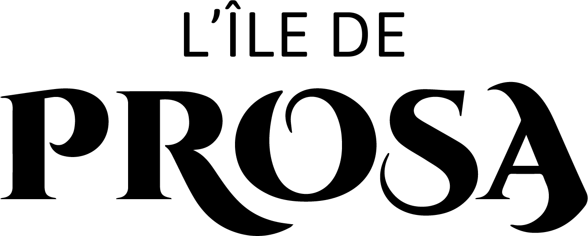

# Prosa

Prosa is a PWA Web App about corsican and provencal culture created by MMI students.

## Installing / Getting started

You only need a phone to play.

Go to this link: [https://depmmi.github.io/prosa](https://mmi-corte.github.io/prosa/)

Enjoy the game.

## Developing

This game is a single page that refreshes its content by calling JavaScript modules based on the content we want to display.

## Contributing

When you publish something open source, one of the greatest motivations is that
anyone can just jump in and start contributing to your project.

These paragraphs are meant to welcome those kind souls to feel that they are
needed. You should state something like:

"If you'd like to contribute, please fork the repository and use a feature
branch. Pull requests are warmly welcome."

If there's anything else the developer needs to know (e.g. the code style
guide), you should link it here. If there's a lot of things to take into
consideration, it is common to separate this section to its own file called
`CONTRIBUTING.md` (or similar). If so, you should say that it exists here.

## Links

Prosa web site : [https://prosa.mmitoulon.fr/](https://prosa.mmitoulon.fr/)

## Licensing

One really important part: Give your project a proper license. Here you should
state what the license is and how to find the text version of the license.
Something like:

"The code in this project is licensed under MIT license."
